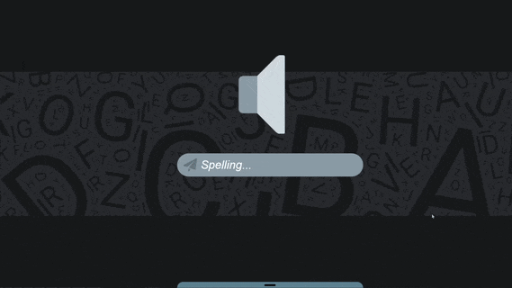

# [Spell-let](https://thetaiman.github.io/Spelling-Project/)
Spell-let is a personal project created to improve my spelling skills (*cuz I suck at it*) by joining all the techniques that make learning easy and convenient. It also had a side benefit of implementing what I have learned so far in programming (*plus trying new things*), killing two birds with one stone.
## Table of contents
* [Description](#description)
* [Technologies](#technologies)
    - [Features](#features)
* [Compatibility](#compatibility)
    - [Browsers](#browsers)
* [Other](#other)
## Description
The best way to learn (*opinion*) is through repetition and separation; these core ideas are at the heart of this project. Repetition means repeating the words that you want to learn. Having the convenience to go back to them anytime you want, even after closing the browser; in other words, having a way to save the words. 

Separation is a way to learn the words by splitting them into syllables, understanding the pieces that combine to create the word in the first place. Everything that is added afterwards is all around these mains concepts.
### Features
(*All the input areas can be submitted by pressing '**Enter**'*)
+ The Speaker Animation (*It also says the word out loud in sync*)

+ The Reveal Word Animation (*It also says the letters/syllables out loud in sync*)

+ Spelling input to the Save input transition (*You can also use the **scroll wheel** to transition*)

+ Add/Remove words (*You can also use the input to select words for removal by typing that word and pressing enter*)      

## Technologies
Project is created with:
* [localStorage](https://developer.mozilla.org/en-US/docs/Web/API/Window/localStorage) (*to save the words*)
* [sessionStorage](https://developer.mozilla.org/en-US/docs/Web/API/Window/sessionStorage) (*to save words for removal*)
* [Web SpeechSynthesis](https://developer.mozilla.org/en-US/docs/Web/API/SpeechSynthesis) (*for saying the words out loud*)
* [jQuary](https://jquery.com/) (*obviously for animation*)
* HTML, CSS, JS (*for the rest*)

## Compatibility
Spell-let is **not mobile friendly**, however it (*mostly*) has responsive design  in terms of usability on PC. An exception of user experience is with Speaker animation when window width is smaller than the word being spoken, it will overflow past the screen size. 

### Browsers
+ Chrome (*recommended*)
+ Microsoft Edge (*intended voice will **not work***)

## Other
I will be adding a way to check if the word saved or about to be saved is an actual word in the English language whenever I get the chance. Also, this was my first big project, hopefully it turned out well and anyone can use it (*besides mobile users, your out of luck*). I have learned a lot while making this project, even when I was about to pull my hair out. One last thought, you might be intrigued or saddened to know that I used PowerPoint to design the whole project :).
